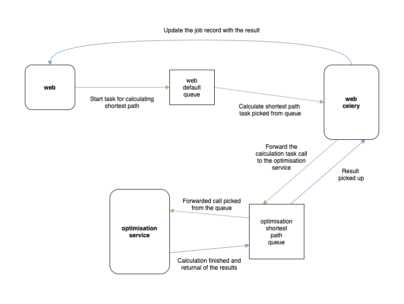

# The travelling salesman
Sample web service determining the cheapest path when visiting N locations

----


----

## Jumpstart

In order to start using the service proceed with the following steps:
* Open a terminal
* Navigate to the root directory of the project
* Call `./jumpstart.sh`

This command will:
* Start all the necessary docker containers
* Perform the database migrations for the (web) Django container
* Create a superuser
* Open the intro page (http://localhost:8005) in the browser

## Architecture

### Overview
The whole ecosystem of the project consists of:
* optimisation_service - the service that does the heavy work of calculating the shortest path
* web - a Django based web application that acts as a proxy for calling the optimisation service
* db - a Postgresql container
* bugsbunny - a RabbitMQ message broker (with management included)
* celery - the web container asynchronous tasks worker
* flower - an extra management dashboard for the RabbitMQ broker

### Interaction between the web, web async tasks and the optimisation service



### The optimisation service

#### Input

Expects to receive the following parameters:
* locations vector
* number of vehicles
* starting location (depot)

#### Output
After the processing the service will resturn the following structure:
```
{
    'indexed_locations': [
        [<location index>, <location coordinates tuple>],
        ...
    ],
    'starting_location': <location index of the starting point / depot>,
    'routes': [
        {
            'vehicle_index': <vehicle index>,
            'total_distance': <total distance of the route>,
            'route': [
                [<location index>, <distance from last location>],
                ...
            ]
        },
        ...
    ]
}
```

#### The web application

Consists of two endpoints:
* `/api/shortest-path-jobs` (accepts GET and POST)
* `/api/shortest-path-jobs/<job uuid>` (accepts only GET)

Interaction with these endpoints is expected to happen in the following manner:

* POST on `/api/shortest-path-jobs` with the locations and other options. Example input:
```json
{
  "locations": [
          [10, 10],
          [10, 12],
          [100, 500],
          [22, 30]
   ],
   "num_vehicles": 1,
   "starting_location": 0
}
```
* the POST will result in a HTTP 202 payload of the following format:
```json
{
   "uuid": "fa163129-5a35-4dff-a714-b47ff4a698b5",
   "status": "pending",
   "result": "",
   "locations": [
       [
           10,
           10
       ],
       [
           10,
           12
       ],
       [
           100,
           500
       ],
       [
           22,
           30
       ]
   ],
   "num_vehicles": 1,
   "starting_location": 0,
   "href": "http://localhost:8005/api/shortest-path-jobs/fa163129-5a35-4dff-a714-b47ff4a698b5/"
}
```
* After a while, the task will complete and it will alter the job record's status and result, and by following the hyperlink present in the original HTTP 202 response, you will be able to see the following:
```json
{
    "uuid": "fa163129-5a35-4dff-a714-b47ff4a698b5",
    "status": "successful",
    "result": {
        "routes": [
            {
                "route": [
                    [
                        0,
                        0
                    ],
                    [
                        1,
                        2
                    ],
                    [
                        3,
                        21
                    ],
                    [
                        2,
                        476
                    ],
                    [
                        0,
                        498
                    ]
                ],
                "vehicle_index": 0,
                "total_distance": 997
            }
        ],
        "indexed_locations": [
            [
                0,
                [
                    10,
                    10
                ]
            ],
            [
                1,
                [
                    10,
                    12
                ]
            ],
            [
                2,
                [
                    100,
                    500
                ]
            ],
            [
                3,
                [
                    22,
                    30
                ]
            ]
        ],
        "starting_location": 0
    },
    "locations": [
        [
            10,
            10
        ],
        [
            10,
            12
        ],
        [
            100,
            500
        ],
        [
            22,
            30
        ]
    ],
    "num_vehicles": 1,
    "starting_location": 0,
    "href": "http://localhost:8005/api/shortest-path-jobs/fa163129-5a35-4dff-a714-b47ff4a698b5/"
}
```

## Credits
Icons made by [Freepik](https://www.flaticon.com/authors/freepik) from [www.flaticon.com](https://www.flaticon.com/)
